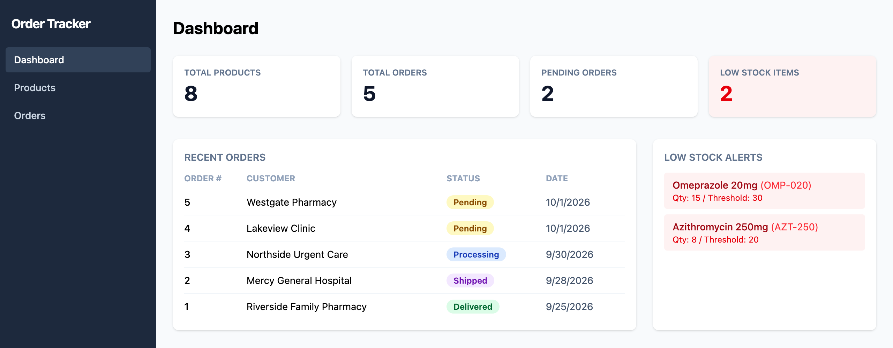
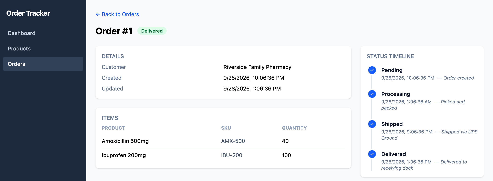

# Inventory & Order Tracker

A full-stack B2B inventory and order fulfillment app. Track products and stock levels, place orders that reserve inventory, and move orders through fulfillment with a complete audit trail.

**Live demo:** [d1t1jyx1chuvoh.cloudfront.net](https://d1t1jyx1chuvoh.cloudfront.net) · **API docs (Swagger):** [d2mg6tq2rf.us-east-1.awsapprunner.com/swagger](https://d2mg6tq2rf.us-east-1.awsapprunner.com/swagger)

> The demo is fully interactive. Create products, place orders, and advance them. Data resets to the sample set on each deploy.





## Features

- **Product management**: create and edit products with unique SKUs and stock levels
- **Order fulfillment workflow**: orders move Pending → Processing → Shipped → Delivered, one step at a time, enforced by the API
- **Inventory control**: placing an order deducts stock in a single transaction; if any line is short, the whole order is rejected and nothing is deducted
- **Low-stock alerts**: products at or below their reorder threshold are flagged on the dashboard and product list
- **Audit trail**: every status change is recorded with a timestamp and optional note
- **Responsive UI**: works on desktop and mobile

## Tech Stack

| Layer | Technology |
|-------|-----------|
| Backend API | ASP.NET Core 8 (C#), REST controllers, Swagger / OpenAPI |
| Data access | Entity Framework Core 8 with migrations |
| Database | SQLite (embedded) |
| Frontend | React 19, TypeScript, Tailwind CSS, React Router, Vite |
| Testing | xUnit integration tests with `WebApplicationFactory` |
| Infrastructure | Docker, AWS App Runner (API), S3 + CloudFront (UI), ECR |

## Architecture

```
┌────────────────────┐   HTTPS / JSON   ┌───────────────────────────┐
│  React SPA         │ ───────────────▶ │  ASP.NET Core 8 Web API   │
│  S3 + CloudFront   │                  │  Docker on AWS App Runner │
└────────────────────┘                  │  EF Core ──▶ SQLite       │
                                        └───────────────────────────┘
```

**Data model:** `Product`, `Order`, `OrderItem`, and `StatusHistory`. An order has many items (each referencing a product) and many history entries.

## Design Notes

- **Transactional stock reservation.** Order creation validates and deducts stock for every line inside one database transaction, so a failure on line 3 never leaves lines 1–2 deducted. Repeated products across lines are checked against their combined quantity.
- **Server-enforced state machine.** Clients can only *advance* an order, never set an arbitrary status, so steps can't be skipped. Advancing past Delivered is rejected.
- **Consistent error contract.** Business-rule failures return `{ message, code }` with stable codes (`INSUFFICIENT_STOCK`, `DUPLICATE_SKU`, `ALREADY_DELIVERED`, …) and the right status code (400, 404, 409), which the UI surfaces directly.
- **SQLite over SQL Server for cost.** The demo originally ran on SQL Server in Amazon RDS. For a portfolio app, that cost roughly $15–20/month for an idle database, so I moved to embedded SQLite. Because data access goes through EF Core, the switch was a provider change plus a regenerated migration. No controller code changed.
- **UTC everywhere.** Timestamps are stored and returned as UTC (`...Z`) and converted to the viewer's local time in the browser.

## API

Interactive docs are available at [`/swagger`](https://d2mg6tq2rf.us-east-1.awsapprunner.com/swagger).

| Method | Endpoint | Description |
|--------|----------|-------------|
| GET | `/api/products` | List all products |
| GET | `/api/products/{id}` | Get a single product |
| POST | `/api/products` | Create a product (409 if SKU exists) |
| PUT | `/api/products/{id}` | Update a product |
| GET | `/api/products/low-stock` | Products at or below reorder threshold |
| GET | `/api/orders?status=` | List orders, optionally filtered by status |
| GET | `/api/orders/{id}` | Get an order with items and history |
| POST | `/api/orders` | Create an order (deducts stock) |
| PUT | `/api/orders/{id}/status` | Advance to the next status |
| GET | `/api/orders/{id}/history` | Status-change audit trail |

## Running Locally

**Prerequisites:** [.NET 8 SDK](https://dotnet.microsoft.com/download/dotnet/8.0) and [Node.js](https://nodejs.org/) 18+. No database server is needed. The SQLite file is created and seeded on first run.

```bash
# API: http://localhost:5239 (Swagger at /swagger)
cd InventoryOrderTracker.Api
dotnet run
```

```bash
# UI: http://localhost:5173
cd order-tracker-ui
npm install
npm run dev
```

## Tests

```bash
dotnet test
```

The test project boots the real API in memory with `WebApplicationFactory`, running the same migrations and seed data against an in-memory SQLite database. It covers stock deduction and rollback, insufficient-stock and unknown-product rejection, combined quantities across lines, the status state machine and its audit trail, duplicate-SKU conflicts, low-stock thresholds, validation, and UTC serialization.

## Deployment

`deploy.sh` builds the API image and pushes it to ECR, updates the App Runner service, builds the UI against the deployed API URL, syncs it to S3, and invalidates the CloudFront cache.
